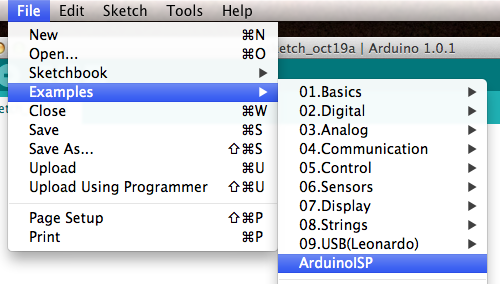
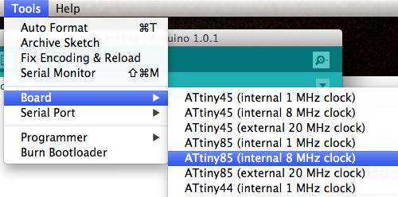
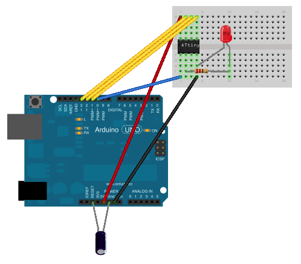
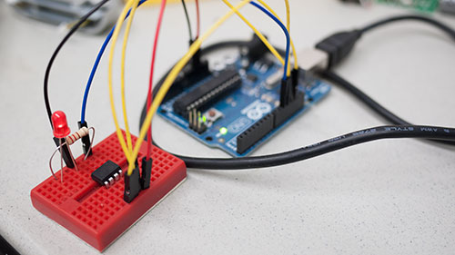
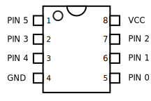

Programming the ATtiny with Arduino
==================================
What's an ATtiny, and why would I need one?
-------------------------------------------

An ATtiny is a microcontroller, similar to the ATMega microcontroller at the heart of the Arduino board. You can write programs for ATtinies using the Arduino language and programming environment, and they can do many of the same things as the ATMega. The difference is that ATtinies are smaller, cheaper, and more power-efficient than the Arduino's microcontroller. If any of these things are important to your project, consider an ATtiny!

Use an Arduino to program the ATtiny
------------------------------------
Uploading a program to an ATtiny is slightly different than uploading to an Arduino: the Arduino has a lot of extra hardware and software on the board that lets you plug it in directly to your computer. The ATtiny, stripped down as it is, doesn't have any of this stuff. But a spare Arduino and a few simple parts can do everything we need.

To connect this little chip to your computer and program it, you'll need the following hardware:

* Arduino Uno
* 10uf capacitor
* breadboard (a small one will work fine)
* 6 jumper wires

And for a basic "blink" circuit to test out this setup, you'll also need:

* LED (spec this more) 
* Resistor (spec this more)

Software Setup
--------------

Before we start wiring things up, we'll need to program the Arduino hardware to act like a microcontroller programmer. Connect your Arduino, open the ArduinoISP sketch (it's in the Arduino Examples folder), and upload it to the Arduino.

Next, we'll need to update the Arduino app with ATTiny "core" files. 

1. Find your Arduino folder (on a Mac, it's in the Documents folder)
2. Create a folder called "hardware" in the Arduino folder
3. Download [this zip file containing the ATTiny core files](http://arduino-tiny.googlecode.com/files/arduino-tiny-0100-0015.zip).
4. Unzip the contents (this should be a folder named "tiny" and a folder named "tools") into the "hardware" folder you just created.
5. Restart the Arduino app.

In the Tools > Board menu, you should see a number of new entries:

Select the ATtiny85 @ 8 MHz board. That's it for the software side -- on to the hardware!

Hardware Setup
--------------
First, make sure to unplug your Arduino. It's safest to hook this stuff up with the power off.

Next, connect the capacitor to the Arduino. Connect the capacitor's negative lead (the one on the side with the stripe) to Gnd on the Arduino, and the positive lead to RESET. 

This capacitor is important -- it prevents the Arduino itself from being re-programmed when you program the ATtiny. If you ever need to re-program the Arduino, and not the ATtiny, you must remove this capacitor first. 

Now, connect your ATtiny to the Arduino and LED as shown here:

Note on the LED - the right side of the LED in this diagram is the anode (the longer pin). Also, make sure that the ATtiny85 is oriented corectly -- there's a little circle in one corner on top of the chip, so make sure that this matches the diagram.

Here's a photo of the final assembly:

That's it! You should be ready to program the ATtiny.
______________

ATtiny Blink
------------
For a first "hello world" program to make sure everything's working, we'll adapt the "Blink" sketch that's in the Arduino's Examples collection so that it'll run on an ATtiny85. 

Open up the "Blink" sketch.

There's one thing we'll need to change in this sketch before it'll work on the ATtiny. The Arduino has lots of input and output pins, and "Blink" is written to use output pin 13. But the ATtiny85 doesn't have a pin 13 -- it only has 6 I/O pins, numbered 0 through 5. Here's a map of the ATtiny85's pins:

So, let's change the "led" variable at the top of the sketch from 13 to 3.

before:

`int led = 13;`

after:

`int led = 3;`
	

